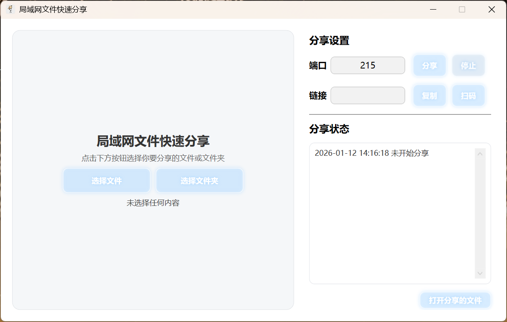
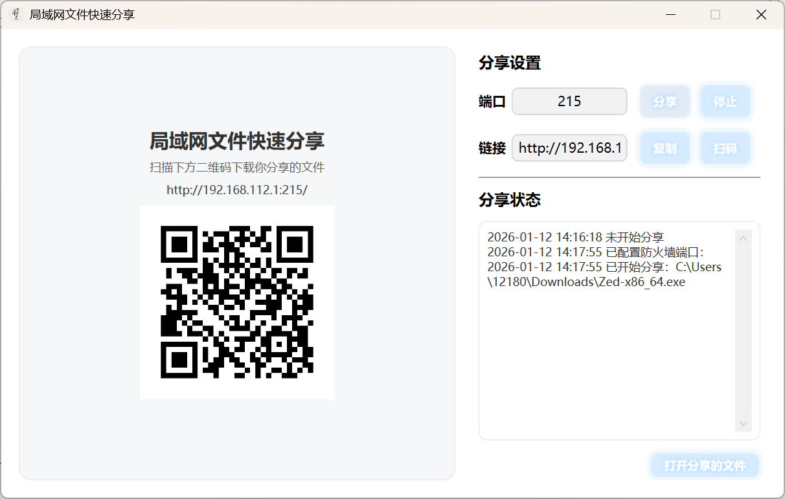
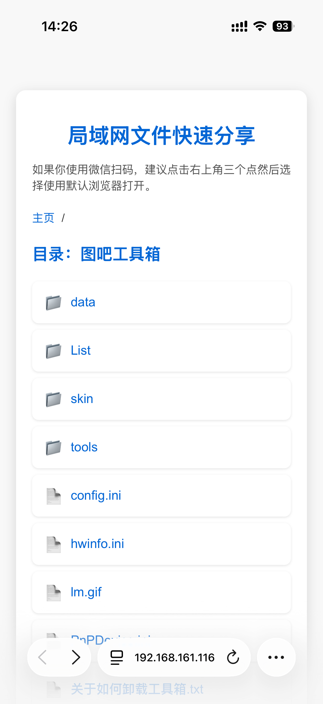
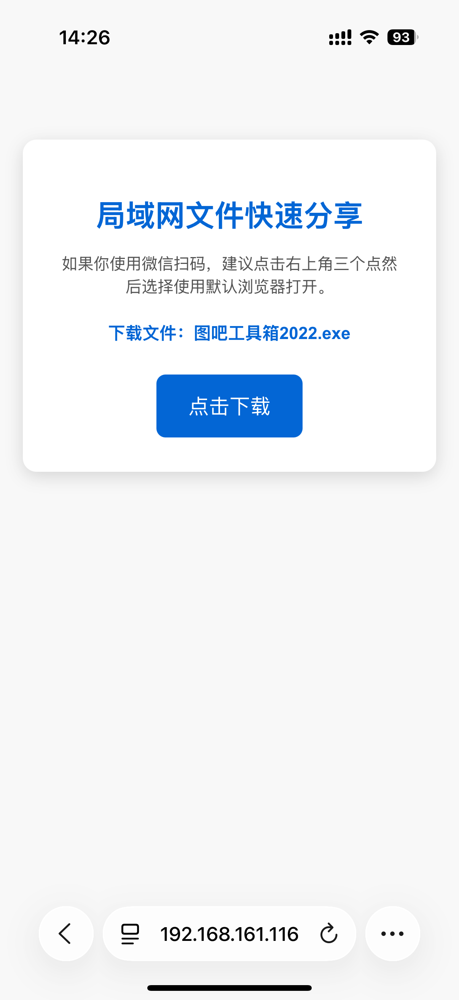

# LAN_Share 局域网文件快速分享工具

一个基于 **C# WPF + HttpListener** 实现的 Windows 桌面应用，用于在 **同一局域网内快速分享文件或文件夹**。  无需安装客户端、无需账号，通过 **浏览器或扫码即可下载**，适合临时文件传输、课堂/宿舍/办公室内共享。

## 功能特性

- 支持分享 **单个文件 / 整个文件夹**
- 内置 HTTP 服务，局域网访问
- 自动生成访问链接 + **二维码**（手机扫码下载）
- 文件夹支持 **目录浏览**
- 支持 **HTTP Range**（断点续传 / 大文件友好）
- 高性能文件传输（大缓冲、异步 IO）
- 自动添加 / 移除 Windows 防火墙规则
- ~~支持 **拖拽文件或文件夹**~~
- 内置简洁、美观的 Web 下载页面（适配手机）

## 使用场景

- 手机与电脑之间快速传文件
- 局域网内多人下载资料
- 无数据线 / 无网盘的临时传输
- 教室、宿舍、会议室内共享文件

## 使用方式

### 1️⃣ 运行程序
直接运行程序（自动更改防火墙规则需要 **管理员权限**）。

### 2️⃣ 选择分享内容
- 点击 **选择文件** 或 **选择文件夹**
- 或直接拖拽文件 / 文件夹到窗口

### 3️⃣ 开始分享
- 默认端口：`215`
- 点击 **开始分享**
- 程序会自动：
  - 获取本机局域网 IP
  - 启动 HTTP 服务
  - 生成访问链接和二维码

### 4️⃣ 访问下载
- 局域网内设备：
  - 浏览器访问：  
    ```
    http://<你的IP>:215/
    ```
  - 或直接扫码下载

### 5️⃣ 停止分享
点击 **停止**，服务关闭并自动清理防火墙规则。

## 界面截图









## 技术实现

- **UI**：WPF
- **HTTP 服务**：`HttpListener`
- **二维码生成**：`QRCoder`
- **网络**
  - 自动获取本机 IPv4
  - 支持 Range 请求
- **文件传输**
  - 大缓冲异步读取
  - `FileStream + SequentialScan`
- **安全**
  - 自动添加/删除 Windows 防火墙入站规则
  - 仅局域网访问（无公网映射）

## 依赖项

- .NET Framework / .NET
- NuGet：
  - `QRCoder`

## 注意事项

- 仅建议在 **可信局域网环境** 使用
- 使用 `HttpListener`，不建议暴露到公网
- 防火墙规则需要管理员权限
- 微信内置浏览器下载大文件可能有限制，建议：
  > 右上角 → 使用默认浏览器打开

## TODO

- 下载进度显示
- 下载访问密码
- 文件大小 / MD5 显示
- 多网卡 IP 选择
- 打包文件夹为 ZIP 下载

